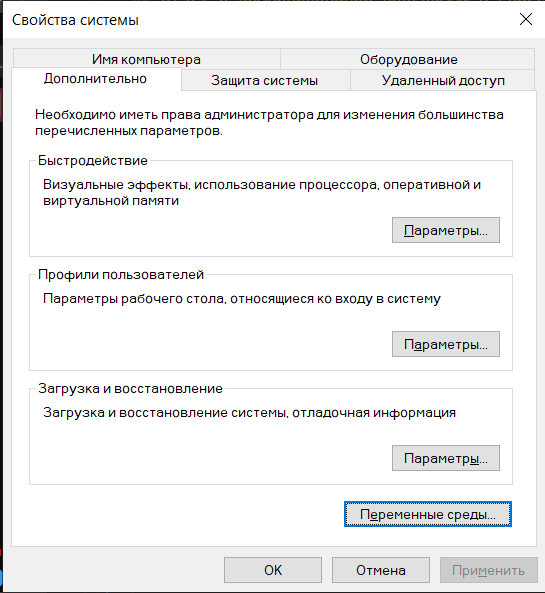
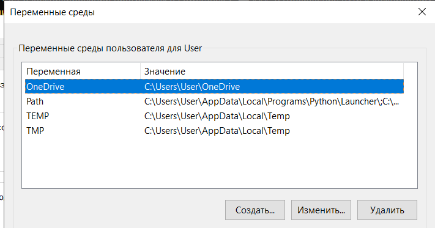

## Отчёт о компилировании программы в PowerShell

### 1. Добавление пути к компилятору `g++` в переменную среды `Path` через свойства системы

Чтобы использовать компилятор `g++` из любой директории в PowerShell, необходимо добавить путь к его исполняемому файлу в системную переменную среды `Path`. Это можно сделать через графический интерфейс Windows.

#### Шаги:

1. Нажмите **Пуск** и введите в поиске:  
   **"переменные среды"**  
   (или "environment variables").

2. В результатах выберите:  
   **"Изменение переменных среды"** или **"Переменные среды"**.

3. Откроется окно **"Свойства системы"**.  
   Внизу окна нажмите кнопку **"Переменные среды"**.


   
4. В разделе **"Системные переменные"** найдите строку **`Path`** и нажмите на неё **"Изменить"**.



5. В открывшемся окне нажмите **"Добавить"** и укажите путь к папке с компилятором.  
   Например:
   ```
   C:\MinGW\bin
   ```
   или
   ```
   C:\msys64\mingw64\bin
   ```

6. Нажмите **"ОК"** во всех окнах для сохранения изменений.

7. Перезапустите PowerShell или командную строку, чтобы изменения вступили в силу.

8. Проверьте установку:

```powershell
g++ --version
```

Если команда выполнится и покажет версию компилятора — путь успешно добавлен.

---

### 2. Основные команды и приёмы работы в PowerShell

Для эффективной работы в консоли необходимо знать базовые команды:

- **`cd <путь>`** — переход в указанную директорию.  
  Пример: `cd C:\projects\quadratic`

- **`cd ..`** — переход на уровень выше.

- **`cd \`** — переход в корневую директорию текущего диска.

- **`ls`** или **`dir`** — отображение содержимого текущей папки.  
  Команда `ls` является алиасом для `Get-ChildItem`.

- **`pwd`** — вывод полного пути к текущей директории.

- **Автодополнение с помощью клавиши Tab** — при вводе части имени файла или папки нажмите `Tab`, чтобы система автоматически дополнела имя. При наличии нескольких совпадений повторное нажатие переключает варианты.

- **Стрелка вверх (↑)** — позволяет просматривать историю ранее введённых команд. Удобно для повторного запуска `g++` или программы.

- **`Ctrl+C`** — прерывание выполнения текущей программы.

---

### 3. Процесс компиляции программы

Структура проекта следующая:

```
C:\projects\quadratic\
    main.cpp
    formulas.cpp
    formulas.h
```

#### Шаг 1: Переход в рабочую директорию

```powershell
cd C:\projects\quadratic
```

#### Шаг 2: Проверка содержимого папки

```powershell
ls
```

Убедитесь, что отображаются файлы `main.cpp`, `formulas.cpp`, `formulas.h`.

#### Шаг 3: Компиляция программы

Выполните команду компиляции:

```powershell
g++ main.cpp formulas.cpp -o program.exe
```

Эта команда:
- Компилирует `main.cpp` и `formulas.cpp`.
- Объединяет объектные файлы.
- Создаёт исполняемый файл `program.exe`.

Если ошибок нет, файл `program.exe` будет создан в текущей директории.

#### Шаг 4: Запуск программы

```powershell
.\program.exe
```

В Windows для запуска исполняемого файла из текущей директории требуется указывать путь `.\`, иначе система не распознает команду.

Программа запросит ввод коэффициентов `ax`, `bx^2`, `c` и выведет результат решения квадратного уравнения.

---

### Заключение

Настройка окружения в PowerShell позволяет компилировать и запускать C++ программы напрямую из командной строки. Ваша программа корректно реализует решение квадратных уравнений всех видов, включая частные случаи. Структура с разделением на `main.cpp`, `formulas.cpp` и `formulas.h` соответствует стандартным практикам проектирования программ на C++. Компиляция осуществляется одной командой, после чего программа выполняется локально с интерактивным вводом данных.